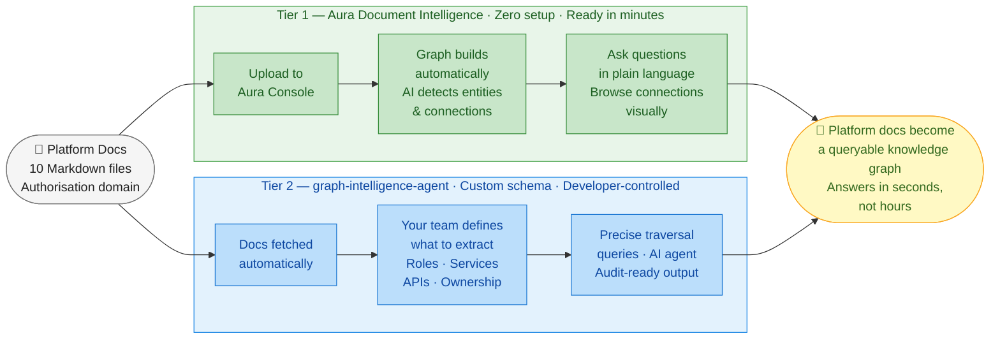
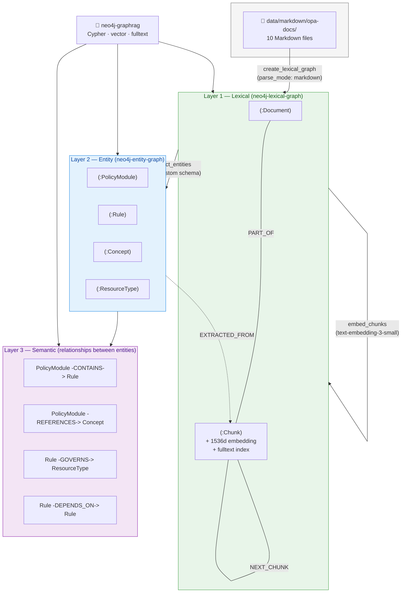

# Securitas Demo — Two-Tier Document Intelligence

**Account:** Securitas Intelligent Services AB
**Demo date:** July 1, 2026
**Demo owner:** Joy Das
**Primary audience:** Mattias Frinnström (commit now or September — last week before summer)
**Secondary audience:** Lukasz Koruba (dev), Wilhelm Öhman (AI team)

> **From Markdown docs to a queryable knowledge graph.** The same 10 OPA authorisation docs, two levels of sophistication, one outcome. The live-call script (statements, queries, talking points) lives in **[demo-questions.md](demo-questions.md)**. This file is the narrative, the technical architecture, and the setup/run guide.

---

## The Two-Tier Narrative

Mattias said on June 3: *"we produce Markdown documentation for our platform for other developer teams… we've discussed making it easy for users to utilise that documentation and ask queries."*

The demo answers this in two passes over the **same OPA documentation corpus**:



### What each tier gives you — and what it proves

|  | **Tier 1 — Aura Document Intelligence** | **Tier 2 — graph-intelligence-agent** |
|--|------------------------------------------|----------------------------------------|
| **Who drives it** | Anyone with Aura access (Mattias) | Engineering team (Lukasz, Wilhelm) |
| **Time to first graph** | Under 10 minutes | Hours — schema design + ingest |
| **Schema** | AI detects automatically | Your team defines exactly what to extract |
| **Querying** | Console chat + Aura Explore | Cypher · vector search · MCP agent |
| **Iteration** | Re-upload to change | Edit the extraction schema file → re-extract |
| **What this proves** | Zero-code path from docs to queryable graph — try it with your own Markdown next week | Custom extraction answers structural questions no keyword search can touch |
| **POC path** | Mattias approves today — no engineering work | 4-week POC, Lukasz defines the schema, 3 named queries |

**The arc:** "Here's what's already in your Aura console today — zero setup. Here's what your engineering team builds when they need control over what gets extracted."

---

## Why OPA Documentation as the Demo Corpus

OPA (Open Policy Agent) documentation is the ideal Securitas proxy:

- **Same format** — Markdown, identical to what Securitas's platform team produces
- **Same domain** — authorization, roles, policies; mirrors the RBAC graph Securitas already runs in Aura
- **Same audience** — developer-facing reference docs consumed by downstream teams
- **Same questions** — "Which OPA modules reference JWT?" ↔ "Which service docs reference role *X*?"

The full OPA → Securitas element-by-element mapping (PolicyModule → service page, Concept → API/role, Rule → access requirement, etc.) is in **[demo-questions.md](demo-questions.md#why-opa-docs-are-a-securitas-proxy--the-mapping)**.

---

## Technical Architecture

Tier 2 builds a **three-layer knowledge graph** on a single AuraDB instance. Each layer is produced by a dedicated MCP server and adds structure the layer below it doesn't have.



### The pipeline (what actually runs)

| Step | Tool (MCP server) | Produces | Time |
|------|-------------------|----------|------|
| 1. Parse Markdown | `create_lexical_graph` — *neo4j-lexical-graph* | `Document` + `Chunk` nodes (token-window chunking), `PART_OF` / `NEXT_CHUNK` | ~36s |
| 2. Embed | `embed_chunks` — *neo4j-lexical-graph* | 1536-d vectors on every chunk, `chunk_text_embedding` vector index + `chunk_text_fulltext` fulltext index | ~30s |
| 3. Compile schema | `convert_schema` — *neo4j-entity-graph* | Pydantic extraction models from the data-model JSON | <1s |
| 4. Extract entities | `extract_entities` — *neo4j-entity-graph* | `PolicyModule` / `Rule` / `Concept` / `ResourceType` + the 4 relationship types, each `EXTRACTED_FROM` its chunk | ~54s |

**Total build: ~2 minutes** → 802 unique entity nodes, 1,099 semantic relationships. Full statistics in **[outputs/reports/opa_auth_policy_report.md](../../outputs/reports/opa_auth_policy_report.md)**.

### The custom schema — file-based, not an Ontology DB

Tier 2's control comes from a **custom extraction schema** your team owns:

- **Data model:** [outputs/data_models/opa_auth_policy_data_model.json](../../outputs/data_models/opa_auth_policy_data_model.json) — the four entity types and four relationships, in the neo4j-data-modeling format.
- **Compiled schema:** [outputs/schemas/opa_auth_policy_schema.py](../../outputs/schemas/opa_auth_policy_schema.py) — Pydantic models `convert_schema` generates from the data model. Field constraints (lowercase keys, enum-validated categories) live here and can be hand-tuned before extraction.
- **Iteration:** edit the data model or the `.py` schema → re-run `extract_entities`. The schema is a versioned file in git — every change is diffable and reviewable.

> **Why file-based and not the Ontology DB / Bloom path?** This demo runs on **AuraDB**, which is single-database and rejects `CREATE DATABASE`. The ontology-DB path (an editable ontology graph, tuned in Neo4j Bloom) requires an instance that supports multiple databases (self-managed or Aura Enterprise with a separate `ontology` DB). The conceptual schema is identical either way; [auth_policy_ontology.cypher](auth_policy_ontology.cypher) captures it in the ontology-DB form for instances that support it.

### Environment

- **Graph:** `neo4j+s://ee0bb26c.databases.neo4j.io` (AuraDB Enterprise 5.27)
- **Embeddings + extraction:** OpenAI (`text-embedding-3-small`, LLM extraction) via LiteLLM — requires `OPENAI_API_KEY`
- **MCP servers:** `neo4j-data-modeling`, `neo4j-lexical-graph`, `neo4j-entity-graph`, `neo4j-graphrag` (see [CLAUDE.md](../../CLAUDE.md) §4)

---

## Technical Setup

### Tier 2 — graph-intelligence-agent (Claude Code, primary path)

**Prerequisites:** [`uv`](https://docs.astral.sh/uv/) installed · Neo4j Aura credentials · OpenAI API key.

```bash
# 1. Fetch the OPA docs corpus → data/markdown/opa-docs/ (10 Markdown files)
python demo/securitas-opa/fetch-opa-docs.py

# 2. Configure credentials and generate MCP configs (.env + .mcp.json + per-tool configs)
./setup.sh

# 3. Open Claude Code in this directory (loads the MCP servers)
claude

# 4. Run the guided workflow
/develop-neo4j-graph
```

When `/develop-neo4j-graph` prompts:

- **Source data:** `data/markdown/opa-docs/` — **parse_mode: `markdown`**
- **Use case:** **ANALYTICAL** (the queries are relationship traversals, not chatbot Q&A)
- **Schema:** the data model at `outputs/data_models/opa_auth_policy_data_model.json` (file-based extraction path)

To run the pipeline by hand instead of the guided skill, execute the four steps in the [pipeline table](#the-pipeline-what-actually-runs) via the corresponding MCP tools.

**Two setup gotchas worth knowing:**

1. **`OPENAI_API_KEY` must be set in `.env`.** A blank key makes `embed_chunks` return *"Embedded 0 chunks"* silently (batch failures are swallowed) — the graph builds with no vectors and vector search returns nothing. Set the key, then restart Claude Code so the MCP servers pick it up.
2. **Windows + Google Drive.** `setup.sh` detects Git Bash/MSYS and (a) rewrites `/g/…` POSIX paths to `G:/…` Windows paths for `uv.exe`, and (b) relocates the MCP virtualenvs to local disk via `UV_PROJECT_ENVIRONMENT` (`C:/Users/<you>/.neo4j-mcp-venvs/…`). Without this, Python imports off the Google Drive FUSE mount take ~38s and the MCP client times out before the server registers. Re-run `./setup.sh` if you move the workspace.

### Tier 1 — Aura Document Intelligence (console, no code)

Built into the Aura console — upload Markdown/PDF/DOCX/TXT/HTML, it extracts entities and relationships automatically and gives you a chat interface. **Docs:** https://neo4j.com/docs/aura/document-intelligence/quick-start/

1. **Enable "Generative AI assistance"** — Aura console → Organisation settings → toggle on.
   *(Off by default for compliance. **BLOCKING** if not done before the call.)*
2. Reuse the corpus from `data/markdown/opa-docs/` (or run `fetch-opa-docs.py`).
3. Aura console → select your AuraDB instance → **Document Intelligence** → **New job** → upload the files → let extraction run (5–10 min).
4. Open the result in **Aura Explore** — have it ready to show at the start of the call.

---

## Running the Demo

Both graphs are **pre-built before the call**. The full 25-minute script — every statement, every Cypher query with its real result shape, and the talking points — is in **[demo-questions.md](demo-questions.md)**.

| Phase | Where | Show |
|-------|-------|------|
| Tier 1 (8 min) | Aura console | Auto-detected schema, natural-language chat, a lexical traversal — "this is in your console today" |
| Pivot (1 min) | — | "Now what your engineering team gets when they define the schema" |
| Tier 2 (10 min) | Claude Code / graphrag MCP | Q1–Q5 + the taxonomy backup query — graph-vs-search contrast, Q2 (auth vs authorisation) is the anchor |
| Close (3 min) | — | Analogy close + POC proposal |

---

## POC Success Criteria (To Agree on July 1)

**Tier 1 POC (immediate, Mattias can approve):**
> Upload a sample of Securitas platform Markdown docs → get an explorable graph and a working chat interface → developers ask questions of the docs in natural language.

**Tier 2 POC (4-week, requires engineering involvement):**
> Ingest a defined Markdown doc set → define the Securitas domain entity schema → run 3 representative traversal queries developer teams ask today and cannot answer with current Azure tooling.

**Proposed 3 queries for the Tier 2 POC:**
1. "Which services depend on [auth-role-X]?" — cross-service dependency traversal
2. "What are all the downstream impacts if we change [API endpoint Y]?" — impact analysis
3. "Which teams' services share access to [data-resource Z]?" — multi-team access pattern

---

## Files in This Directory

| File | Purpose |
|------|---------|
| [README.md](README.md) | This file — narrative, technical architecture, setup, and run guide |
| [demo-questions.md](demo-questions.md) | Live-call readout — statements, Cypher + natural-language questions, talking points, 25-min agenda |
| [fetch-opa-docs.py](fetch-opa-docs.py) | Downloads the OPA Markdown corpus to `data/markdown/opa-docs/` |
| [auth_policy_ontology.cypher](auth_policy_ontology.cypher) | The schema in ontology-DB form — for instances that support multiple databases; the demo used the file-based path |

**Generated artifacts (in `outputs/`):**

| Artifact | Purpose |
|----------|---------|
| [outputs/data_models/opa_auth_policy_data_model.json](../../outputs/data_models/opa_auth_policy_data_model.json) | The custom entity/relationship data model |
| [outputs/schemas/opa_auth_policy_schema.py](../../outputs/schemas/opa_auth_policy_schema.py) | Compiled Pydantic extraction schema |
| [outputs/reports/opa_auth_policy_report.md](../../outputs/reports/opa_auth_policy_report.md) | Full graph statistics and validated query results |
