<!-- _class: lead -->


# Graph Intelligence Agent
### Technical Deep Dive

*Joy Das · Field Engineering · Neo4j*

---

## Agenda

1. **Context & Business Value** — the problem, the approach, the benefits
2. **The Methodology** — how we do it, end to end
3. **Your Data** — what we work with and how we connect it
4. **Entity & Relationship Extraction** — turning documents into knowledge
5. **Technical Deep Dive** — schema, parsing, extraction, validation, retrieval
6. **Case Study: Opposing Counsel** — 20 legal judgments → graph intelligence in 4 min
7. **Your Turn** — think about your data, draft your first schema

---

<!-- _class: lead -->

# Context & Business Value
### The problem, the approach, the benefits

---


<!-- _class: dense -->
## Critical knowledge is trapped in your documents

Most enterprise AI systems can search documents. **None of them can reason over the knowledge inside them.**

<div style="display:flex; gap:2rem;">
<div>

### What your documents contain
- Regulatory decisions and their rationale
- Drug interactions across 10,000 trial reports
- Contractual obligations across 50,000 agreements
- Engineering failures and their root causes
- Competitive intelligence across hundreds of filings

</div>
<div>

### What your AI can actually reach
- Text that looks similar to the query
- Top-k chunks — disconnected from each other
- No relationships, no cross-document reasoning
- No traceability to source

</div>
</div>

> **The gap:** your documents contain connected knowledge. Your AI sees isolated text fragments.

---


<!-- _class: dense -->
## Why vector RAG hits an accuracy ceiling

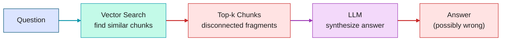

**The limited levers problem** — you can improve:
- Chunking strategy, embedding model, re-ranking, prompt engineering

**But you cannot fix:**
- *"Which law firms have acted for sovereign states AND also appeared for claimants?"*
- *"Which barristers consistently appear together on the defence side across 20 cases?"*
- *"Has this firm switched sides in enforcement proceedings?"*

These require **traversal across connected entities** — not similarity search.

---


<!-- _class: dense -->
## What graph intelligence changes

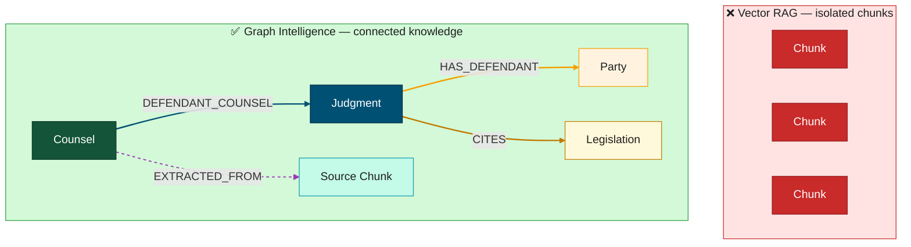

**The shift:** from finding *similar text* to traversing *connected knowledge*

- Questions that span multiple documents → answered in one graph traversal
- Every answer carries a `EXTRACTED_FROM` chain → full source traceability
- Structured data connects to unstructured knowledge → one unified graph

---


<!-- _class: dense -->
## Benefits — what becomes possible

<div style="display:flex; gap:2rem;">
<div>

### Accuracy
- Answers complex multi-hop questions that vector RAG cannot
- Graph pre-filters candidate set → fewer hallucinations
- Schema-constrained extraction → typed, validated entities

### Traceability
- Every answer cites its source chunk, section, and document
- Auditable by design — required for regulated industries
- `EXTRACTED_FROM` chain queryable in Cypher

</div>
<div>

### Cross-document reasoning
- Traverse relationships across thousands of documents in milliseconds
- Connect unstructured knowledge to structured databases
- Answer questions that required a human analyst before

### Speed at scale
- *"10 hours of legal research → 30 seconds"* — law firm, 185M+ documents
- *"80% reduction in research time"* — industrial engineering, 20-year archive
- *"Weeks → seconds"* — pharma drug safety, 25 siloed R&D systems

</div>
</div>

---

<!-- _class: dense -->
## Who is building this — use cases by vertical

<div style="display:flex; gap:2rem;">
<div>

### Financial Services
- Analyst research KG · credit risk Q&A
- AML entity resolution · financial crime intelligence
- Regulatory compliance · SOP intelligence

### Healthcare / Life Sciences
- Drug-target discovery · scientific literature mining
- Regulatory submission intelligence (ICH M4Q, HL7 FHIR)
- Clinical trial cross-document analysis

### Manufacturing & Engineering
- Engineering doc Q&A · maintenance intelligence
- Supply chain documentation · parts traceability
- Quality reports · root cause analysis across archives

</div>
<div>

### Technology & SaaS
- Product knowledge graph · customer support Q&A
- SRE runbook graph · incident & ops intelligence

### **Professional Services & Legal** ← *today's demo*
- **Litigation intelligence** — who appeared, which side, what outcome
- **Opposing counsel profiling** — barrister track records across judgments
- Legal doc cross-reference · M&A contract intelligence
- Tax law KG · legislation traceability

### Consumer Products, Energy & Government
- Claims intelligence · fraud detection
- Legislative archives · case intelligence

</div>
</div>

---


<!-- _class: dense -->
## Is this the right approach for you?

<div style="display:flex; gap:2rem;">
<div>

### Strong fit
- Large document corpus that users struggle to query today
- Answers require connecting information **across multiple documents**
- Existing search or RAG returns incomplete or inconsistent results
- Source citations and audit trails are required *(compliance, regulatory)*
- Both documents and structured databases need to be connected
- A specific use case and target users are already identified

</div>
<div>

### Questions to answer before starting
- What are the 10–20 specific questions this system must answer?
- Who are the end users, and how will they interact with it?
- Are domain experts available to define the schema and validate answers?
- Is there budget and time for schema design and data preparation?
- Who owns the success criteria and the go/no-go decision?
- Is the corpus large enough to justify graph extraction vs. standard RAG?

</div>
</div>

> **Experience shows:** a focused use case with defined questions, available domain experts, and an iterative approach consistently delivers. A broad scope with no defined target rarely does.

---

<!-- _class: lead -->

# The Methodology
### How we do it, end to end

---

<!-- _class: dense -->
## The methodology — start small, validate, grow

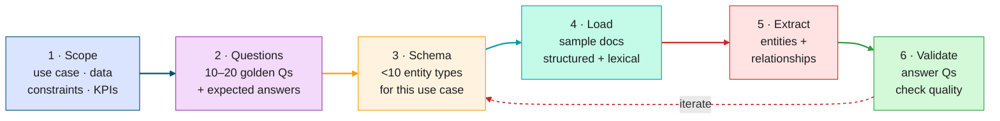

**Start small on every dimension** — then grow once each layer is validated:

- **Documents:** a representative sample, not the full corpus — enough to cover your question types
- **Schema:** fewer than 10 entity types to start — add more after validation
- **Questions:** 10–20 to start — the list grows as the schema matures

> **Why this matters:** POC discipline builds production intuition. Teams that validate on samples consistently build better — and faster — production systems than those who extract everything first.

---

## Knowledge graph construction


---

<!-- _class: lead -->

# Your Data
### What we work with — and how we connect it

---


<!-- _class: dense -->
## Neo4j — the superset for RAG


**One graph, all your data.** Structured records and extracted document knowledge connect through shared entities — a single Cypher query can traverse from a PDF sentence to a database row.

---


<!-- _class: dense -->
## All formats are possible — PDF requires the most work

| Format | Quality | Note |
|---|---|---|
| SQL · CSV · Excel · JSON | **Best** | Import directly as nodes — no parsing needed |
| XML *(patents, legal, regulatory)* | **Excellent** | Rich structure preserved; clause hierarchy queryable |
| Markdown · HTML · EPUB | **Excellent** | Native structure; fast to parse and chunk |
| Email · JSONL · API exports | **Good** | Import as nodes; extract entities from text properties |
| Word · DOCX · RTF | **Good** | Layout and metadata mostly intact |
| PowerPoint · PPTX | **Moderate** | Slide-as-page; use page image mode |
| PDF *(digital)* | **Hard** | Layout lost, tables mangled — **no single parser works for all PDF types** |
| Scanned PDF | **Hardest** | OCR errors compound every downstream step |

> **Always ask for the original format.** Patents, legal contracts, regulatory submissions, and internal docs are frequently available in XML, JSON, or Markdown — far easier to parse than their PDF renditions.

**Semi-structured data (JSON, XML, email) — two paths:**
- *Import as nodes* — text fields become node properties → extract entities directly from those properties
- *Build a lexical graph* — when the document structure itself needs to be traversed → next slide

---


<!-- _class: dense -->
## The lexical graph — structure, context and provenance

When the document structure itself carries meaning — section hierarchy, reading order, table position — we build a **lexical graph** that mirrors it faithfully in Neo4j.

<div style="display:flex; gap:2rem; align-items:flex-start;">
<div style="flex:1;">

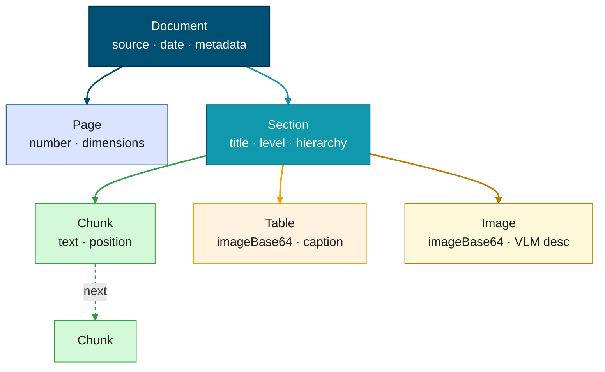

</div>
<div style="flex:1;">

### Benefits over flat chunking

- **Structural chunking** — chunk boundaries respect section and paragraph boundaries, not arbitrary token limits
- **Rich context** — every chunk knows its section title, parent hierarchy, page number, and caption
- **Precise provenance** — bounding boxes stored on every element → pixel-level tracing back to the original document
- **Multimodal** — tables and images become first-class nodes, described by a VLM and embedded alongside text

</div>
</div>

---


## Lexical graph — core vs. expanded model

<div style="display:flex; gap:2rem; align-items:flex-start;">
<div style="flex:1; text-align:center;">

### Core model · pymupdf · fast


*Best for: emails, reports, contracts, legal judgments*

</div>
<div style="flex:1; text-align:center;">

### Expanded model · docling · structure-aware


*Best for: research papers, regulatory filings, financial reports*

</div>
</div>

> **Both models support multimodality** — a Chunk (or Element) node can be a text chunk, an image chunk, or a table chunk.

---


<!-- _class: dense -->
## Multimodal extraction — tables, images, diagrams and beyond

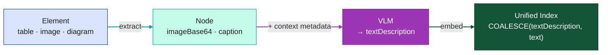

**Retrieval options:**
- **VLM description + text embedding** — semantic similarity search over visual content *(default)*
- **Table as HTML or Markdown** — structure preserved for direct LLM reasoning *(simple tables)*
- **Multimodal embeddings** — image + text embedded together for richer visual retrieval
- **Agent vision** — agent retrieves `imageBase64` + context directly and interprets on-the-fly

*Non-informative elements (logos, decorative images) can be filtered at retrieval time to keep search results clean.*

> **Beyond documents:** the same pattern extends to audio transcripts and video keyframes — stored as nodes with embeddings and graph context.

---


<!-- _class: dense -->
## From data to a unified knowledge graph

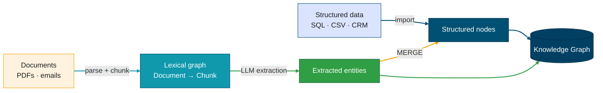

- **Structured data** loads directly as typed graph nodes — relationships already defined
- **Documents** parse into a lexical graph — structure and context preserved in Chunk nodes
- But chunks and structured nodes **don't know about each other** until entity extraction runs
- **Entity extraction** reads through chunks, identifies typed entities and relationships, and writes them to the graph — where they merge with structured records on a shared key

> **Entity extraction is the bridge** — the next section covers how it works.

---

<!-- _class: lead -->

# Entity & Relationship Extraction
### Turning documents into connected knowledge

---


<!-- _class: dense -->
## From documents to knowledge — the extraction concept

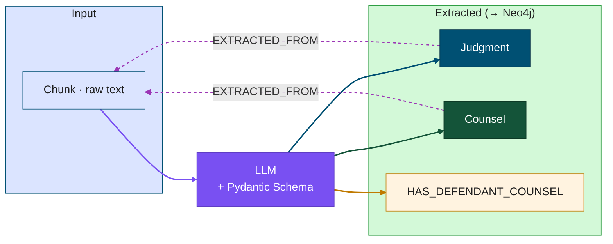

**What happens during extraction:**
- Each chunk is processed by the LLM with a Pydantic schema as the instruction set
- The LLM identifies and types entities and relationships from the text
- Extracted nodes and relationships are written to Neo4j — each linked back to its source `Chunk` via `EXTRACTED_FROM`
- **Deduplication is automatic** — identical entities extracted from different chunks are merged into a single node as they are written to the graph

---


<!-- _class: dense -->
## The entity graph — entities + relationships + provenance

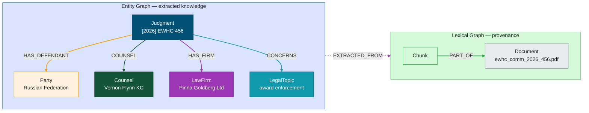

**Every entity is traceable.** Any answer the AI gives can be followed back to the exact source text, section, and document — without any post-hoc explanation.

---

<!-- _class: invert -->

## What becomes possible

Before graph intelligence, these questions required a human analyst:

> *"Which law firms have acted for sovereign states resisting enforcement of arbitral awards, and have any of them also appeared on the claimant side?"*

> *"Who appeared for the Russian Federation across its cases before the Commercial Court, and what was the outcome in each matter?"*

> *"Which barristers appeared most in jurisdiction challenges on the defence side — and which chambers do they come from?"*

**With the entity graph**, each of these is one Cypher traversal — answered in milliseconds, with source citations.

---


<!-- _class: dense -->
## Three layers — one knowledge graph

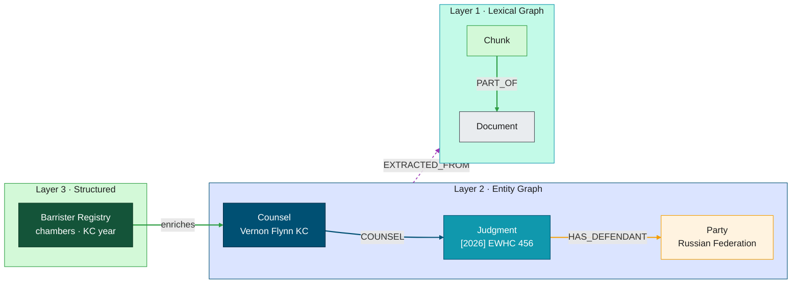

**Layer 1 — Lexical graph:** document structure and provenance · every chunk traces back to its source
**Layer 2 — Entity graph:** typed entities and relationships extracted from chunk text · linked to chunks via `EXTRACTED_FROM`
**Layer 3 — Structured data:** imported directly · merged with extracted entities on a shared key

---

<!-- _class: lead -->

# Technical Deep Dive
### Live walkthrough with the Neo4j MCP Workspace

---

<!-- _class: dense periwinkle -->

## Neo4j MCP Workspace — rapid graph prototyping

An open-source workspace that connects an AI coding agent (Claude Code or Cursor) to purpose-built tools for building Neo4j knowledge graphs end to end.

- **MCP servers** — specialized tools the agent calls for each task: schema design, document parsing and chunking, entity extraction, graph querying and evaluation
- **Skills** — pre-built guided workflows that automate the full pipeline with flexibility at each step — from schema design to the first Q&A report
- Works for any skill level: full automation for a first result, full control for advanced customization
- Supports 100+ LLM providers — any model your organization approves

*Open source · [github.com/neo4j-field/neo4j-mcp-workspace-template](https://github.com/neo4j-field/neo4j-mcp-workspace-template)*
*Demo fork · [github.com/joy-neo4j/graph-intelligence-agent](https://github.com/joy-neo4j/graph-intelligence-agent)*

---

## The 5 MCP servers

<div style="display:flex; gap:1rem; margin-top:0.8rem;">

<div style="flex:1; text-align:center;">
<div style="background:#014063; border-radius:10px; padding:1rem 0; font-size:2rem;">🗂️</div>

**Data Modeling**

Design and validate your graph schema from sample data

</div>
<div style="flex:1; text-align:center;">
<div style="background:#0A6190; border-radius:10px; padding:1rem 0; font-size:2rem;">🗄️</div>

**Ingest**

Load structured CSV data into Neo4j using parameterized Cypher

</div>
<div style="flex:1; text-align:center;">
<div style="background:#145439; border-radius:10px; padding:1rem 0; font-size:2rem;">📄</div>

**Lexical**

Parse documents into a searchable, embeddable graph of chunks

</div>
<div style="flex:1; text-align:center;">
<div style="background:#C07A00; border-radius:10px; padding:1rem 0; font-size:2rem;">🔍</div>

**Entity**

Extract structured entities and relationships from chunks using LLM/VLM

</div>
<div style="flex:1; text-align:center;">
<div style="background:#D43300; border-radius:10px; padding:1rem 0; font-size:2rem;">🤖</div>

**GraphRAG**

Query your graph with vector, fulltext, and Cypher search patterns

</div>
</div>

---

<!-- _class: invert -->

## A tool for fast iteration — not the end product

- Load a sample of your documents and structured records in minutes
- Validate schema choices — which entities actually answer your questions
- Test parsing methods side by side — find the right approach for your document type
- Measure extraction quality against your golden questions early
- **Go to production faster** — Neo4j Professional Services' AI Starter Kit takes your workspace schema and parameters as direct input to a production-grade pipeline

> **Prove it works. Then do it right.** Show that Neo4j answers questions no RAG system could before — and use the prototype to lock in schema, parsing, and extraction choices before committing to production.

*For a full walkthrough, see the [Nodes AI 2026 presentation](https://www.youtube.com/watch?v=MCFey7xXYo4).*

---


<!-- _class: dense -->
## Start with your evaluation set

> **RAG is always targeted.** The schema, the extraction, the retrieval — all of it is optimized to answer specific questions. Without them, you have no target.

**Before building anything, write down:**

1. **10–20 priority questions** — what must this system answer?
2. **Expected answer** for each question — what does "correct" look like?
3. **Source** — which document, section, or data record contains the answer?

This is your **golden dataset** — the measure of everything:
- Drives schema design (what entities do you need to extract?)
- Drives extraction validation (are those entities being found?)
- Drives retrieval tuning (is the right context being retrieved?)
- Drives production monitoring (nightly regression against expected answers)

---

## Graph schema design — the Minimum Viable Graph

**85% of production customers** define their schema before touching data.

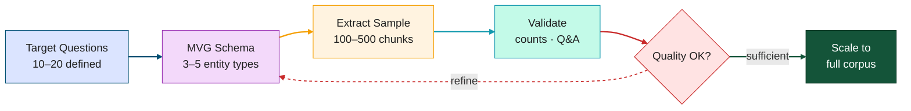

**MVG principle:** one use case · 3–5 entity types · prove it works · then expand.
Adding entity types incrementally is cheaper than reworking a bloated schema.

---


<!-- _class: dense -->
## Document parsing — choose the right tool

<div style="display:flex; gap:1.5rem; margin-top:0.5rem;">
<div style="flex:1; border-left:4px solid #0A6190; padding-left:1rem;">

### PyMuPDF
*Default · fastest*

- Text-heavy docs, papers, reports, **legal judgments**
- Tables and images extracted as images
- No section awareness
- **Use when:** fast parsing, no complex layout

</div>
<div style="flex:1; border-left:4px solid #145439; padding-left:1rem;">

### Docling
*Structure-aware*

- Complex layouts: multi-column, text boxes
- Complex tables become structured `Table` nodes
- Section hierarchy with `assign_section_hierarchy`
- **Use when:** structure and context are needed

</div>
<div style="flex:1; border-left:4px solid #C07A00; padding-left:1rem;">

### Page Image
*Visual content*

- Slides, diagrams, complex visual layouts
- Each page captured as an image
- Fast (parallelized)
- **Use when:** layout IS the meaning

</div>
</div>

**Decision rule:** does meaning live in the **text**, the **table structure**, or the **visual layout**?

---


<!-- _class: dense -->
## Lexical graph — the ingestion sequence

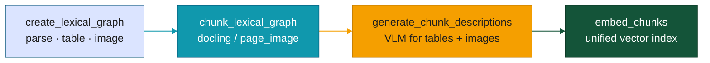

**Key details:**
- `generate_chunk_descriptions` — VLM describes tables and images → `textDescription` field
- `embed_chunks` — auto-detects `textDescription`, uses `COALESCE(textDescription, text)` → one unified index for text, tables, and images
- `assign_section_hierarchy` (optional) — LLM infers heading levels for complex docs (legal, regulatory)

---

## Pydantic schema — extraction quality multiplier

<!-- _class: dense -->

```python
class CounselEntity(BaseModel):
    """A barrister or advocate appearing in the case."""

    name: str = Field(           # ✅ KC suffix stripped — isKc captures status separately
        ..., description="Full name WITHOUT KC/QC suffix (e.g. 'Vernon Flynn', not 'Vernon Flynn KC')")
    isKc: Optional[bool] = Field(
        default=None, description="Whether the barrister holds King's Counsel status")

    @field_validator("name", mode="before")
    @classmethod
    def normalize_name(cls, v: object) -> object:    # ✅ normalize at extraction — not post-hoc
        if isinstance(v, str):
            v = v.strip()
            for suffix in (" KC", " QC", " (KC)", " (QC)"):
                if v.upper().endswith(suffix.upper()):
                    v = v[:-len(suffix)].strip(); break
        return v
```

**Five rules:** clear docstring · `Field()` descriptions · concrete examples · `@field_validator` · **distinct field names across all entity types** (same field name = LLM picks first entity type, ignores the rest)

> *"A mediocre small model with a tight Pydantic schema produces cleaner graph data than a frontier model with free-text extraction."*

---


<!-- _class: dense -->
## Entity extraction — the iterative loop

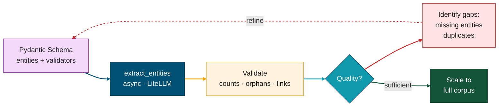

**What each gap tells you:**
- Missing entities → improve field description or add example
- Duplicate nodes → add `@field_validator` normalization
- Low relationship coverage → clarify relationship description or split into passes
- Questions not answered → schema gap → add entity type

---


<!-- _class: dense -->
## Validate early — after every run

```cypher
-- Entity counts (plausible for your corpus?)
MATCH (n:Counsel) RETURN count(n) AS counsel
MATCH (n:LawFirm) RETURN count(n) AS firms
MATCH (n:LegalTopic) RETURN count(n) AS topics   -- should match Literal vocabulary size

-- Orphan nodes (no relationships = extraction without connection)
MATCH (n:Counsel) WHERE NOT (n)--()
RETURN count(n) AS orphanCounsel

-- Relationship coverage — key traversals for target questions
MATCH ()-[:HAS_DEFENDANT_COUNSEL]->() RETURN count(*) AS defCounselLinks
MATCH ()-[:HAS_CLAIMANT_FIRM]->()     RETURN count(*) AS claimantFirmLinks

-- Provenance chain intact
MATCH (n:Counsel)-[:EXTRACTED_FROM]->(c:Chunk)
RETURN count(n) AS linked
```

**Check after every iteration:** counts · orphans · relationship coverage · duplicates · entity reconciliation (extracted names vs structured names)

---


<!-- _class: dense -->
## Retrieval — GraphRAG MCP server tools

| Tool | What it does | Best for |
|---|---|---|
| `get_neo4j_schema_and_indexes` | Discovers graph schema, vector and fulltext indexes | Schema exploration, agent initialization |
| `vector_search` | Semantic similarity search using embeddings | Open-ended, conceptual questions |
| `fulltext_search` | Keyword search with Lucene syntax (AND, OR, fuzzy) | Exact names, codes, identifiers |
| `read_neo4j_cypher` | Executes read-only Cypher queries | Counts, filters, aggregations, traversals |
| `search_cypher_query` | Combines vector/fulltext search with graph traversal | Multi-hop, cross-document questions |
| `read_node_image` | Retrieves base64 images stored on nodes | Multimodal analysis, visual content retrieval |

The **ReACT agent** selects tools dynamically — one question may invoke several in sequence, using the result of each to inform the next.

---


<!-- _class: dense -->
## Workspace reports — evaluate and iterate

**Q&A evaluation report** — generated automatically at the end of every run:

| Per question | What it shows |
|---|---|
| **Retrieval path** | Method used (vector / fulltext / Cypher / combined) + actual query |
| **Answer** | Result retrieved from the graph |
| **Quality** | Complete · Partial · Not answered |
| **Improvement note** | What would make this answer better — more data, schema change, different parse mode |

Also includes: entity counts · gap analysis · recommended next steps for the full pipeline.

**On-demand reports** — ask the coding agent at any time:
- **QC & deduplication report** — surfaces duplicates, near-matches, and low-confidence entities with concrete suggestions to refine the schema
- Each report feeds directly back into the iteration loop: schema refinement → re-extraction → re-evaluation

---

<!-- _class: lead -->

# Case Study: Opposing Counsel
### 20 EWHC Commercial Court judgments → litigation intelligence in 4 minutes

---

<!-- _class: dense -->
## The use case — competitive intelligence for litigation partners

**The problem:** preparing for a high-stakes commercial dispute means knowing who will appear on the other side. Today, a junior lawyer traws through PDFs one by one, building a spreadsheet that is out of date before it is finished.

**The corpus:** 20 approved judgments from England and Wales High Court, Commercial Court (2026) — international arbitration enforcement, anti-suit injunctions, s.67/68 challenges under the Arbitration Act 1996.

**The questions a litigation partner needs answered:**
1. Which law firms have acted for sovereign states resisting enforcement — and have any switched sides?
2. Who appeared for the Russian Federation, and what was the outcome?
3. Which barristers have the most experience defending states in jurisdiction challenges?
4. Has Quinn Emanuel ever acted against a sovereign state respondent?
5. Which barristers appeared in Energy Charter Treaty cases, and who instructed them?

---

<!-- _class: dense -->
## The graph data model — Opposing Counsel

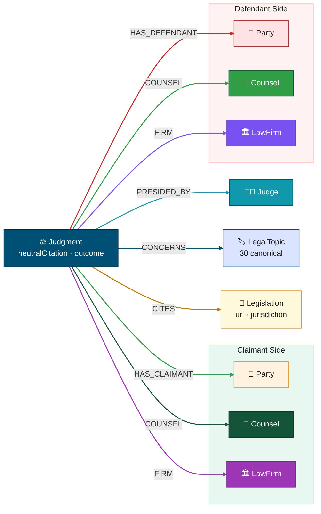

**7 node types · 9 relationship types · all enriched via CSV bridge nodes**

---

<!-- _class: dense -->
## Pipeline timings — 20 documents, 4 minutes total

| Step | Tool | Config | Time |
|---|---|---|---|
| PDF parse + chunk | `create_lexical_graph` | pymupdf · no tables/images | 83s |
| Embed 891 chunks | `embed_chunks` | text-embedding-3-small · parallel=50 | ~20s |
| Entity extraction | `extract_entities` | gpt-5.4-mini · Pydantic v3 · parallel=50 | ~100s |
| CSV enrichment | `ingest_csv_into_neo4j` × 3 | barristers · firms · legislation | ~5s |
| **Total** | | | **~4 min** |

**Graph result (after pass 3 + deduplication):**

| Entity | Count | Notes |
|---|---|---|
| Document · Chunk | 20 · **891** | all embedded, vector index online |
| Judgment · Counsel · LawFirm | 28 · **86** · **39** | deduped, KC suffix stripped, firm aliases resolved |
| LegalTopic | **30** | Literal constraint: 1,278 → 30 |
| Party · Legislation · Judge | 261 · 135 · 58 | |

---

<!-- _class: dense -->
## Schema v3 — the three key validators

**1. LegalTopic: `Literal` constraint (1,278 → 30)**
```python
LEGAL_TOPIC_CANONICAL = Literal[
    "arbitral award enforcement", "jurisdiction challenge", "anti-suit injunction",
    "section 67 challenge", "section 68 challenge", "investment treaty arbitration",
    "energy charter treaty", "new york convention", "sovereign immunity", ...
]
```

**2. Counsel: KC suffix stripper**
```python
for suffix in (" KC", " QC", " (KC)"):
    if v.upper().endswith(suffix.upper()):
        v = v[:-len(suffix)].strip(); break
```

**3. LawFirm: alias map**
```python
_ALIASES = {
    "Gibson Dunn": "Gibson Dunn & Crutcher LLP",
    "Quinn Emanuel": "Quinn Emanuel Urquhart & Sullivan UK LLP",
    "Stephenson Harwood": "Stephenson Harwood LLP", ...
}
return _ALIASES.get(v, v)
```

---

<!-- _class: dense -->
## The 5 questions — answered by graph traversal

**Q1: Law firms on both sides of sovereign enforcement?**
```cypher
MATCH (j:Judgment)-[:HAS_DEFENDANT]->(p:Party)
WHERE toLower(p.name) CONTAINS 'republic' OR toLower(p.name) CONTAINS 'federation'
MATCH (j)-[:HAS_DEFENDANT_FIRM]->(f:LawFirm)
WITH f.name AS firm, collect(DISTINCT j.neutralCitation) AS defendantCases
OPTIONAL MATCH (j2:Judgment)-[:HAS_CLAIMANT_FIRM]->(f2:LawFirm {name: firm})
RETURN firm, size(defendantCases) AS defended, collect(DISTINCT j2.neutralCitation) AS alsoClaimant
```
→ **Quinn Emanuel** and **Gibson Dunn** both appeared on claimant side in other proceedings.

**Q3: Top defence-side KCs for jurisdiction challenges?**
```cypher
MATCH (j:Judgment)-[:HAS_DEFENDANT]->(p:Party)
WHERE toLower(p.name) CONTAINS 'republic' OR toLower(p.name) CONTAINS 'federation'
MATCH (j)-[:HAS_DEFENDANT_COUNSEL]->(c:Counsel {isKc: true})
RETURN c.name, c.chambers, c.kcYear, count(DISTINCT j) AS caseCount
ORDER BY caseCount DESC
```
→ **Vernon Flynn KC** (Brick Court, KC 2006) — 5 appearances in Hulley/Russia proceedings

---

<!-- _class: dense -->
## Graph beats pure RAG — head to head

| Question | Pure vector RAG | Graph RAG |
|---|---|---|
| "Has Quinn Emanuel acted on both sides?" | ❌ Reads every mention separately | ✅ `MATCH (j)-[:HAS_CLAIMANT_FIRM\|HAS_DEFENDANT_FIRM]->(f)` |
| "Who appeared with Vernon Flynn KC?" | ❌ Needs cross-chunk reasoning | ✅ `MATCH (j)-[:HAS_DEFENDANT_COUNSEL]->(c1) MATCH (j)-[:HAS_DEFENDANT_COUNSEL]->(c2)` |
| "Which Tier 1 boutiques appeared in ECT cases?" | ❌ Firm tier not in text | ✅ Traversal + CSV-enriched `f.arbitrationTier` |
| "Which statutes appear only in s.67 cases?" | ❌ Set difference impossible | ✅ `WHERE NOT EXISTS { MATCH (j2)-[:CONCERNS]->(:LegalTopic {name:'section 68'}) }` |
| "What did the judge say about public policy?" | ✅ Works | ✅ Also works + structured context (parties, outcome) |

---

<!-- _class: dense -->
## Structured data enrichment — CSV bridge nodes

Three CSVs enrich the extracted graph with data that cannot be reliably extracted from PDF text:

| CSV | Enriches | New properties | Enables |
|---|---|---|---|
| `barristers.csv` (30 rows) | `Counsel` nodes | `chambers`, `kcYear`, `callYear`, `specialisms` | "Was this barrister KC at the time of hearing?" |
| `law_firms.csv` (39 rows) | `LawFirm` nodes | `firmType`, `arbitrationTier`, `legal500`, `foundedYear` | "Do Tier 1 boutiques win more often?" |
| `legislation.csv` (18 rows) | `Legislation` nodes | `url`, `jurisdiction`, `category` | Link to legislation.gov.uk XML for section-level queries |

```cypher
UNWIND $records AS record
MERGE (c:Counsel {name: record.name})    -- MERGE onto extracted node
SET c.chambers = record.chambers,
    c.kcYear = toInteger(record.kc_year)
```

→ 150 properties set on Counsel · 229 on LawFirm · 115 on Legislation

---

<!-- _class: invert -->

## Your golden dataset — the source of truth

**Build it with your SMEs (one afternoon):**
- 50–100 questions · expected answers · source document + section
- Covers factual, comparative, and multi-hop question types

**Use it throughout the project:**
- After every schema iteration → measure improvement
- After extraction scale-up → detect regressions
- In production → nightly regression, operational health

**Operational signals:**
- Zero-result rate < 5% = healthy retrieval
- Text-to-Cypher failure rate > 10% = schema too complex for query type
- Avg tool calls / query trending up = agent struggling to find answers

> **This dataset is your contract with the system.** Everything is optimized against it.

---


<!-- _class: dense -->
## Your turn — think about your data

<div style="display:flex; gap:2rem;">
<div>

### Your documents
- What types? *(PDF, HTML, XML, Word, database exports)*
- What volume? *(number of docs, approximate size)*
- Tables or diagrams that carry key information?
- Can you reach the upstream source for any PDF?

### Your questions
- What are your **10–20 priority questions?**
- Expected answer + source document for each?
- Who are your SMEs — the people who know what "correct" is?

</div>
<div>

### Your first schema
- 3 most important entity types from your questions?
- Relationships connecting them?
- Merge key for each entity? *(name, code, ID)*

### Your constraints
- LLM provider allowed? *(OpenAI, Azure, Bedrock, Vertex, on-premise)*
- RBAC requirements? *(who can see what data?)*
- Update pattern? *(full reload vs incremental delta)*

</div>
</div>

---

<!-- _class: dense forest -->

## Draft your first schema — right now

**Step 1 — Name your 3 main entity types** *(5 min)*
What are the most important "things" in your target questions?

**Step 2 — Name the relationships** *(5 min)*
How do they connect? Use verb phrases:
`APPROVED_FOR` · `AUTHORED_BY` · `REFERENCES` · `HAS_DEFENDANT_COUNSEL` · `SUPERSEDES`

**Step 3 — Identify the merge key** *(2 min)*
What property makes two mentions of the same entity "the same"?
→ Usually `name`, sometimes a domain code (drug code, regulation ID, contract number, neutral citation)

**Step 4 — Map to your questions** *(5 min)*
For each of your 5 priority questions: can this schema answer it?

> **Output:** a first schema sketch — 3 entities, 2–3 relationships. Enough to start extracting on workshop day one.

---

<!-- _class: lead -->

# Thank You

### *Joy Das · Field Engineering · Neo4j*

**Next step:** Workshop — documents → graph → Q&A in 2 hours

MCP Workspace — `github.com/neo4j-field/neo4j-mcp-workspace-template`
Demo fork — `github.com/joy-neo4j/graph-intelligence-agent`
Neo4j GraphRAG Python — `neo4j.com/docs/neo4j-graphrag-python`
Neo4j Aura — `console.neo4j.io`
